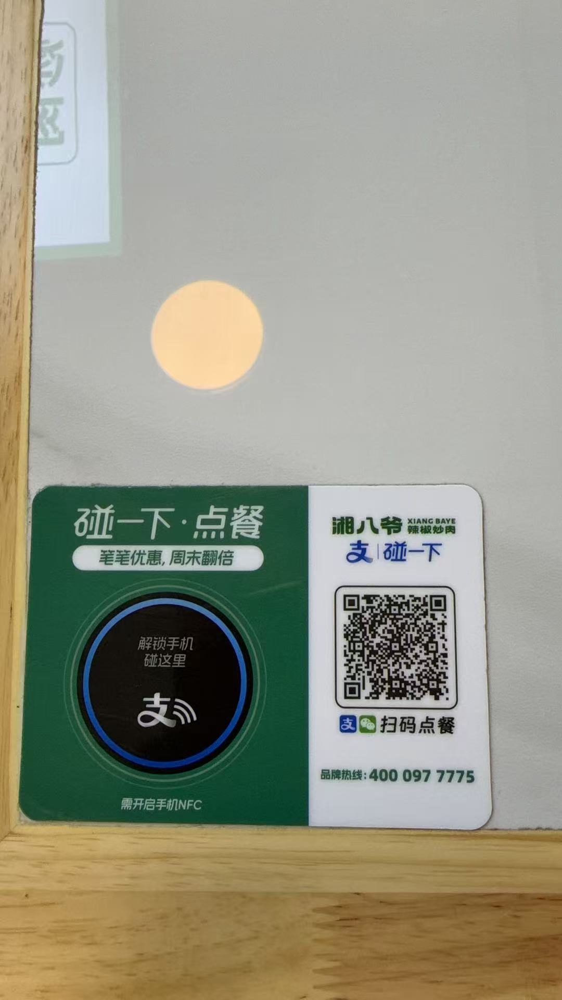
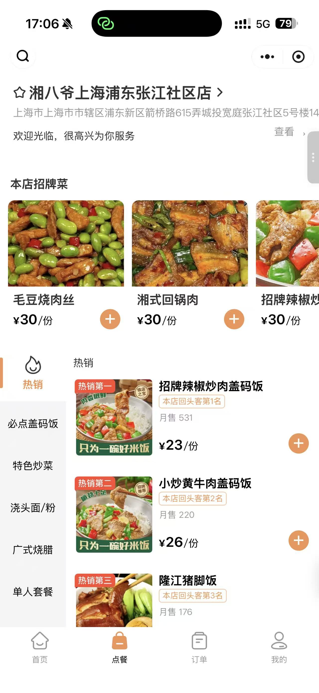
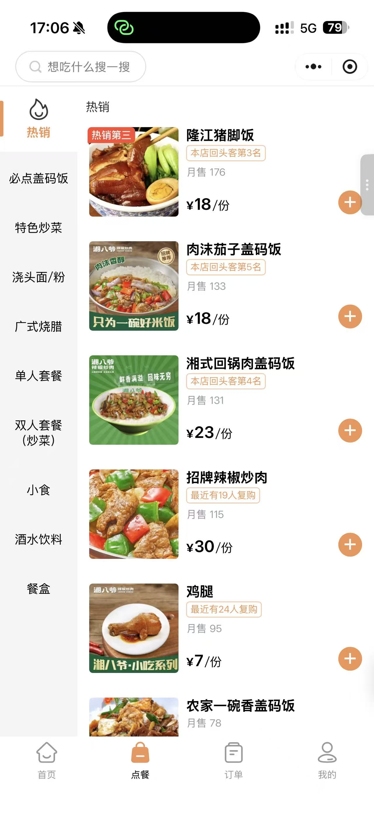
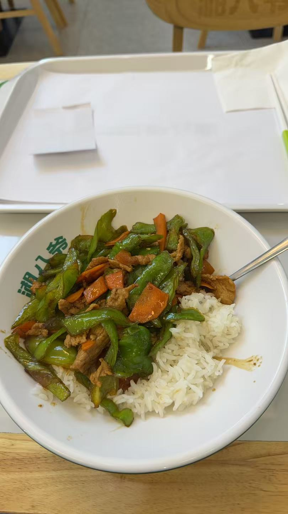

# 湘八爷 上海浦东张江社区店

> 信息来源：住户提供点餐牌、点餐小程序截图和菜品实拍。  
> 记录日期：2026-06-17。  
> 价格和月售以截图时点为准。

## 基本信息

| 项目 | 信息 |
|---|---|
| 店名 | 湘八爷 上海浦东张江社区店 |
| 品类 | 湘菜、盖码饭、小炒、烧腊、小食 |
| 位置线索 | 截图显示位于浦东新区箭桥路615弄城投宽庭张江社区 5 号楼附近 |
| 点餐方式 | 支付宝/微信扫码点餐，店内点餐牌显示支持“碰一下点餐” |
| 品牌热线 | 400 097 7775 |
| 适合场景 | 工作日晚餐、单人正餐、想吃重口味下饭菜 |

## 菜单摘录

| 菜品 | 价格 | 月售/标签 |
|---|---:|---|
| 招牌辣椒炒肉盖码饭 | 23 元/份 | 本店回头客第 1 名，月售 531 |
| 小炒黄牛肉盖码饭 | 26 元/份 | 本店回头客第 2 名，月售 220 |
| 隆江猪脚饭 | 18 元/份 | 本店回头客第 3 名，月售 176 |
| 肉沫茄子盖码饭 | 18 元/份 | 本店回头客第 5 名，月售 133 |
| 湘式回锅肉盖码饭 | 23 元/份 | 本店回头客第 4 名，月售 131 |
| 招牌辣椒炒肉 | 30 元/份 | 最近有 19 人复购，月售 115 |
| 鸡腿 | 7 元/份 | 最近有 24 人复购，月售 95 |
| 毛豆烧肉丝 | 30 元/份 | 招牌菜 |
| 湘式回锅肉 | 30 元/份 | 招牌菜 |
| 农家一碗香盖码饭 | 截图未完整显示 | 月售 78 |

## 可见菜单分类

- 热销
- 必点盖码饭
- 特色炒菜
- 浇头面/粉
- 广式烧腊
- 单人套餐
- 双人套餐（炒菜）
- 小食
- 酒水饮料
- 餐盒

## 图片素材

| 图片 | 说明 |
|---|---|
|  | 店内扫码点餐牌 |
|  | 点餐小程序菜单顶部 |
|  | 热销列表与分类 |
|  | 菜品实拍，具体菜名待确认 |

## 待核实

- 准确门牌号
- 营业时间
- 堂食座位情况
- 是否支持外卖或打包
- 菜品实拍对应菜名
- 辣度、出餐速度和整体推荐程度
